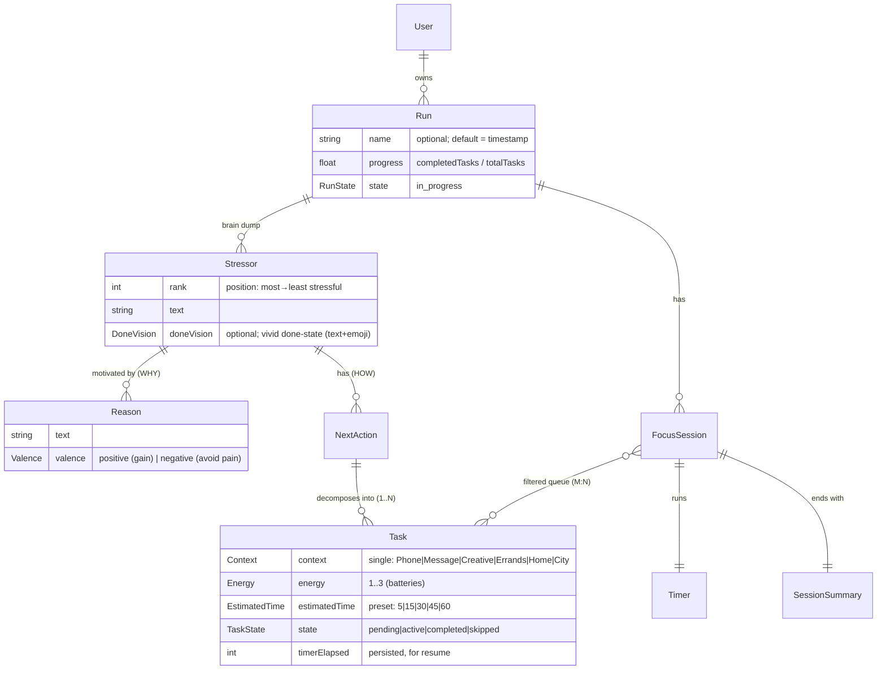

# Entity Map

Struktura domenowa: co istnieje w systemie, jak się łączy, do kogo należy i jakie ma stany.
Nazwy encji są po angielsku — to identyfikatory, które wejdą do kodu. Opisy po polsku.

## Diagram

**Typy wartości (atrybuty, nie encje):** `Context` (enum), `Energy` (1–3), `EstimatedTime` (preset), `Valence` (positive|negative), `DoneVision` (text+emoji).
**Pomijalnie jako encje (przejściowe ekrany/kroki):** `BrainDump`, `StressRanking`, `Processing`, `SessionFilter`, `Dashboard`.

## Entities

### User
**Description**: Jedyna rola — autor projektu używający aplikacji jako osobistego narzędzia. Single-user, lokalne (localStorage).
**Instances per user**: Jeden (brak kont, tożsamość = urządzenie).
**Ownership**: Posiada wszystkie Runy i ich zawartość.
**Lifecycle**: Stała, bezstanowa tożsamość lokalna.
**States**: brak.
**Contains**: Runy.
**Belongs to**: —.

### Run
**Description**: Jeden pełny przejazd lejka (brain dump → ranking → next-actions → procesowanie → wybór sesji → focus → celebracja). Pojemnik najwyższego poziomu. Trzyma historię, więc runy można porównywać i czerpać z nich motywację.
**Instances per user**: Wiele (historia zostaje).
**Ownership**: User.
**Lifecycle**: Tworzony przy „start new"; trwały między otwarciami apki; wznawialny; możliwy do usunięcia.
**States**: `in_progress` (domyślny, wznawialny). Brak wymuszonego stanu terminalnego — run jest „gotowy", gdy user jest usatysfakcjonowany / wszystkie taski done; sygnałem na żywo jest `progress`.
**Contains**: Stressory, FocusSessiony.
**Belongs to**: User.

### Stressor
**Description**: Pojedyncza stresująca rzecz wyrzucona z głowy w brain dumpie. Surowy materiał, zanim zostanie rozbity na akcje.
**Instances per Run**: Wiele (0..N; dodawane w kroku 1).
**Ownership**: Run.
**Lifecycle**: Tworzony w brain dumpie → ustawiany `rank` (ranking) → przy review-on-resume decydowane, czy nadal obowiązuje → ewentualnie usuwany.
**States**: brak formalnych; niesie `rank` (pozycja od najbardziej do najmniej stresującego) — ustalany ręcznie (układanie listy) lub przez `Pairing` (porównania parami). Na resume: *relevant* / *stale (do usunięcia)*.
**Contains**: NextActiony; **Reasons** (materiał motywacyjny) + opcjonalny `doneVision`.
**Belongs to**: Run.

### Reason
**Description**: Pojedynczy powód, dla którego stresor jest dla usera ważny — element materiału motywacyjnego (odpowiedź na „dlaczego"). Niesie walencję: pozytywną (zysk) lub negatywną (uniknięcie bólu). Tworzony w `decompose`; konsumowany później, np. w `focus`.
**Instances per Stressor**: Wiele (0..N).
**Ownership**: Stressor / Run.
**Lifecycle**: Tworzony w `decompose` → edytowalny / usuwalny; konsumowany w `focus` (wyświetlany jako motywacja).
**States**: brak formalnych; niesie `valence`.
**Attributes**: `valence`: `Valence` — `positive` (zysk) | `negative` (uniknięcie bólu).
**Contains**: —.
**Belongs to**: Stressor.

### NextAction
**Description**: Kierunek / pomysł, co pchnie stresor do przodu. Grubszy niż task — może być konkretny (→ 1 task) albo rozbity na kilka.
**Instances per Stressor**: Wiele (0..N; dopisywane w kroku 3).
**Ownership**: Stressor / Run.
**Lifecycle**: Tworzony w kroku 3 → opcjonalnie rozbity na Taski → edytowalny / usuwalny.
**States**: brak formalnych.
**Contains**: Taski (1..N; ≥1 wymagane, żeby wejść do lejka dalej).
**Belongs to**: Stressor.

### Task
**Description**: Atomiczna, wykonywalna jednostka — element listy focus. Nosi kontekst, energię i szacowany czas. Powstaje z NextAction (rozbicie 1..N; konkretny NextAction = 1 Task).
**Instances per NextAction**: 1..N.
**Ownership**: NextAction / Run.
**Lifecycle**: Tworzony (rozbicie lub bezpośrednio) → atrybuty przypięte w Processing → cyklony przez sesje focus → completed / skipped → możliwy do wyczyszczenia (ClearCompleted).
**States**: `pending` → `active` → `completed` | `skipped`.
  - `Skip` → `skipped` → (przy **następnej** sesji) → `pending`.
  - `Back` → reaktywacja poprzedniego (znów `active`); bieżący wraca jako `pending`.
**Attributes**:
  - `context`: `Context` (dokładnie jeden) — `Phone` | `Message` | `Creative` | `Errands` | `Home` | `City`
  - `energy`: `Energy` — 1..3 (bateryjki: 1 = Low, 3 = High)
  - `estimatedTime`: `EstimatedTime` — preset `5` | `15` | `30` | `45` | `60` min
  - `timerElapsed`: licznik upłyniętego czasu — persystowany, do wznowienia timera
**Contains**: —.
**Belongs to**: NextAction.

### FocusSession
**Description**: Przejście focus: wyfiltrowany zestaw tasków przerabiany po jednym pod timerem, zakończony podsumowaniem.
**Instances per Run**: Wiele (0..N; kilka sesji w jednym Runie na różnych filtrach).
**Ownership**: Run.
**Lifecycle**: Tworzona przy Start (po SessionFilter) → taski cyklone → kończy się SessionSummary.
**States**: `running` (aktywny task pod timerem) | `paused` | `finished`.
**Contains**: wyfiltrowane Taski (M:N), Timer, SessionSummary.
**Belongs to**: Run.

### Timer
**Description**: Odliczanie dla aktywnego taska; startuje od jego `EstimatedTime`, po dojściu do zera leci dalej w górę. **Pamięta pozycję** — po pauzie/wznawianiu kontynuuje tam, gdzie stanął (stan licznika trzymany per Task: `timerElapsed`).
**Instances per FocusSession**: Jeden (UI); stan per Task.
**Ownership**: FocusSession.
**Lifecycle**: Tworzony z sesją; wartość persystowana; wznawiany.
**States**: `running` | `paused` | `overtime` (>0 po przekroczeniu zera).
**Contains**: —.
**Belongs to**: FocusSession.

### SessionSummary
**Description**: Ekran na końcu sesji: zrobione taski + łączny czas spędzony na zadaniach + akcja „Usuń skończone" (moment celebracji).
**Instances per FocusSession**: Jedno.
**Ownership**: FocusSession.
**Lifecycle**: Generowane po zakończeniu sesji; ClearCompleted usuwa completed taski.
**States**: brak (widok).
**Contains**: —.
**Belongs to**: FocusSession.
