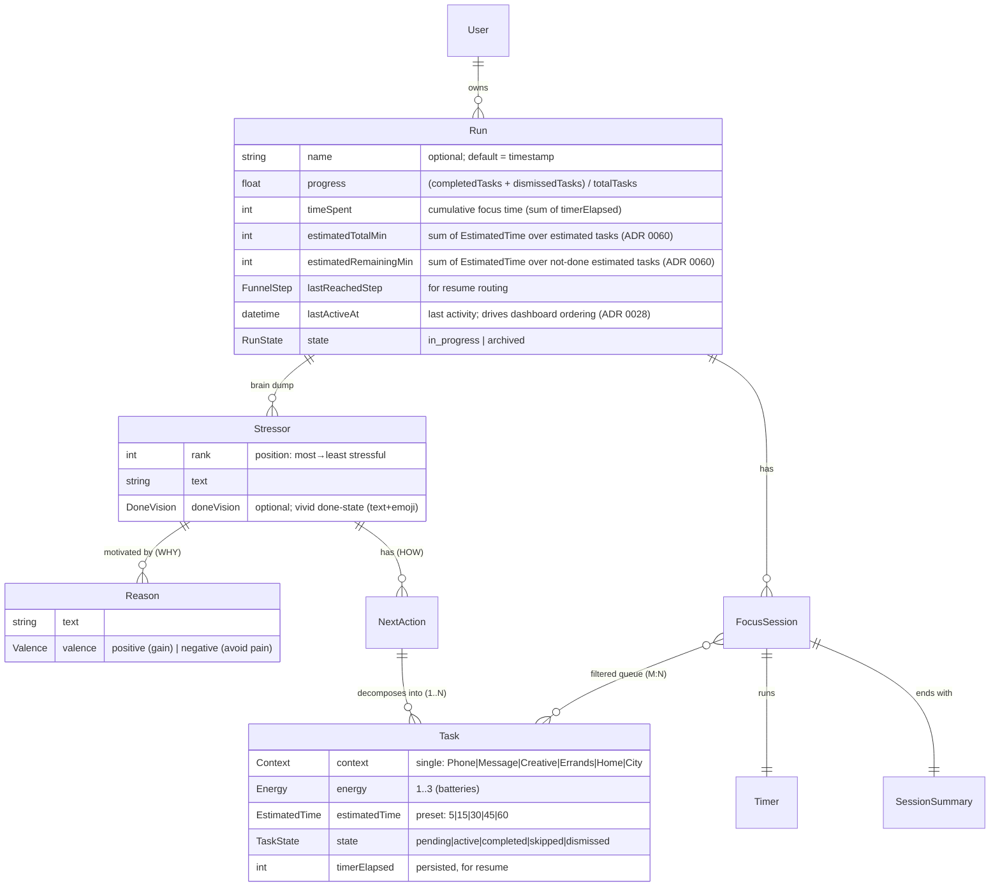

# Entity Map

Domain structure: what exists in the system, how things connect, who owns what, and what states each thing has.
Entity names are in English — they are identifiers that will go into the code. Descriptions are in English.

## Diagram

```mermaid
erDiagram
    User ||--o{ Run : "owns"
    Run ||--o{ Stressor : "brain dump"
    Stressor ||--o{ Reason : "motivated by (WHY)"
    Stressor ||--o{ NextAction : "has (HOW)"
    NextAction ||--o{ Task : "decomposes into (1..N)"
    Run ||--o{ FocusSession : "has"
    FocusSession }o--o{ Task : "filtered queue (M:N)"
    FocusSession ||--|| Timer : "runs"
    FocusSession ||--|| SessionSummary : "ends with"

    Task {
        Context context "single: Phone|Message|Creative|Errands|Home|City"
        Energy energy "1..3 (batteries)"
        EstimatedTime estimatedTime "preset: 5|15|30|45|60"
        TaskState state "pending|active|completed|skipped|dismissed"
        int timerElapsed "persisted, for resume"
    }
    Stressor {
        int rank "position: most→least stressful"
        string text
        DoneVision doneVision "optional; vivid done-state (text+emoji)"
    }
    Reason {
        string text
        Valence valence "positive (gain) | negative (avoid pain)"
    }
    Run {
        string name "optional; default = timestamp"
        float progress "(completedTasks + dismissedTasks) / totalTasks"
        int timeSpent "cumulative focus time (sum of timerElapsed)"
        int estimatedTotalMin "sum of EstimatedTime over estimated tasks (ADR 0060)"
        int estimatedRemainingMin "sum of EstimatedTime over not-done estimated tasks (ADR 0060)"
        FunnelStep lastReachedStep "for resume routing"
        datetime lastActiveAt "last activity; drives dashboard ordering (ADR 0028)"
        RunState state "in_progress | archived"
    }
```

**Value types (attributes, not entities):** `Context` (enum), `Energy` (1–3), `EstimatedTime` (preset), `Valence` (positive|negative), `DoneVision` (text+emoji), `RunState` (`in_progress` | `archived`), `FunnelStep` (a funnel step, drives resume routing), `TaskOrder` (an ordered list of task IDs — the manual queue order; relation `Run 1—1 TaskOrder 1—* Task`), `activeRunId` (a pointer to the currently worked-on Run — set on Create/Continue; scopes the funnel data on the funnel screens; ADR 0044).
**Optionally entities (transient screens/steps):** `BrainDump`, `StressRanking`, `Processing`, `SessionFilter`, `Dashboard`.

**`TaskOrder` — one shared ordering model (ADR 0036):** an ordered list of task IDs; default (empty / after reset) = order by stressor rank (like `attributed` in `FocusView`). Manual reordering (drag / ↑↓ on the focus filter list) overrides it. The same `TaskOrder` decides the order in **three places**: the matched list in the focus filter, the session queue after Start, and the task list on Run Details (sort within state groups). Global in the prototype; per `per-run-funnel-isolation` (ADR 0044) ultimately **per-Run** — each Run gets its own `TaskOrder`.

## Entities

### User
**Description**: The only role — the project's author using the app as a personal tool. Single-user, local (localStorage).
**Instances per user**: One (no accounts; identity = device).
**Ownership**: Owns all Runs and their contents.
**Lifecycle**: A constant, stateless local identity.
**States**: none.
**Contains**: Runs.
**Belongs to**: —.

### Run
**Description**: One full run through the funnel (brain dump → ranking → next-actions → processing → session selection → focus → celebration). The top-level container, a **visible object with statistics** (ADR 0020). Holds history, so runs can be compared and mined for motivation.
**Instances per user**: Many — they live in parallel, launched from the dashboard (history stays).
**Ownership**: User.
**Lifecycle**: Created on "start new" (`capture` implicitly); durable across app openings; resumable (Continue — ADR 0022); archived manually (reversibly); can be permanently deleted.
**States**: `in_progress` (active, visible in the active list, resumable) | `archived` (hidden from active, visible in the archive/history, reversible via Un-archive — ADR 0021). No formal terminal state other than deletion; "completed" is a value derived from `progress`, not a separate state.
**Attributes**:
  - `name`: string — optional; defaults to date/time.
  - `progress`: float — `(completedTasks + dismissedTasks) / totalTasks`.
  - `timeSpent`: int — total time from focus (sum of `timerElapsed` across tasks/sessions).
  - `estimatedTotalMin`: int — total **estimated time** (sum of `EstimatedTime` across estimated tasks; the size of the work in the run). Derived live in `deriveRunStats`, not persisted (ADR 0060).
  - `estimatedRemainingMin`: int — **remaining** estimated time (sum of `EstimatedTime` across estimated tasks with state ∉ `completed`/`dismissed`). Derived live (ADR 0060).
  - `lastReachedStep`: `FunnelStep` — the furthest funnel step reached; drives Continue routing.
  - `lastActiveAt`: `datetime` — timestamp of the last activity in the Run (work in the funnel, Continue); drives sorting on the dashboard and the choice of the dominant card (ADR 0028).
**Contains**: Stressors, FocusSessions.
**Belongs to**: User.

### Stressor
**Description**: A single stressful thing emptied from the head in the brain dump. Raw material, before it gets broken into actions.
**Instances per Run**: Many (0..N; added in step 1).
**Ownership**: Run.
**Lifecycle**: Created in the brain dump → gets a `rank` (ranking) → at review-on-resume it's decided whether it still applies → possibly removed.
**States**: no formal ones; carries a `rank` (position from most to least stressful) — set manually (list ordering) or via `Pairing` (pairwise comparisons). On resume: *relevant* / *stale (to remove)*.
**Contains**: Next-actions; **Reasons** (motivational material) + optional `doneVision`.
**Belongs to**: Run.

### Reason
**Description**: A single reason this stressor matters to the user — an element of the motivational material (the answer to "why"). Carries a valence: positive (gain) or negative (avoiding pain). Created in `decompose`; consumed later, e.g. in `focus`.
**Instances per Stressor**: Many (0..N).
**Ownership**: Stressor / Run.
**Lifecycle**: Created in `decompose` → editable / removable; consumed in `focus` (shown as motivation).
**States**: no formal ones; carries `valence`.
**Attributes**: `valence`: `Valence` — `positive` (gain) | `negative` (avoiding pain).
**Contains**: —.
**Belongs to**: Stressor.

### NextAction
**Description**: A direction / idea for what will push the stressor forward. Coarser than a task — it can be concrete (→ 1 task) or broken into several.
**Instances per Stressor**: Many (0..N; added in step 3).
**Ownership**: Stressor / Run.
**Lifecycle**: Created in step 3 → optionally broken into Tasks → editable / removable.
**States**: no formal ones.
**Contains**: Tasks (1..N; ≥1 required to proceed further into the funnel).
**Belongs to**: Stressor.

### Task
**Description**: An atomic, executable unit — an item on the focus list. Carries a context, energy, and estimated time. Comes from a NextAction (a 1..N breakdown; a concrete NextAction = 1 Task).
**Instances per NextAction**: 1..N.
**Ownership**: NextAction / Run.
**Lifecycle**: Created (via breakdown or directly) → attributes pinned in Processing → cycled through focus sessions → completed / skipped → clearable (ClearCompleted).
**States**: `pending` → `active` → `completed` | `skipped` | `dismissed`.
  - `Skip` → `skipped` → (at the **next** session) → `pending`.
  - `Back` → reactivates the previous (now `active` again); the current one returns as `pending`.
  - `Dismiss` → `dismissed` (terminal; does **not** come back in later sessions; visible in `SessionSummary`, counts toward progress, undo — ADR 0017).
**Attributes**:
  - `context`: `Context` (exactly one) — `Phone` | `Message` | `Creative` | `Errands` | `Home` | `City`
  - `energy`: `Energy` — 1..3 (batteries: 1 = Low, 3 = High)
  - `estimatedTime`: `EstimatedTime` — preset `5` | `15` | `30` | `45` | `60` min
  - `timerElapsed`: an elapsed-time counter — persisted, for resuming the timer
  - **Nullability**: `context`, `energy`, `estimatedTime` are **optional (nullable)** — assigned in `process`, but each can be skipped (nudge, ADR 0007/0013); a task without a given attribute doesn't qualify for sessions that require it.
**Contains**: —.
**Belongs to**: NextAction.

### FocusSession
**Description**: A focus pass: a filtered set of tasks worked through one at a time under a timer, ending with a summary.
**Instances per Run**: Many (0..N; several sessions in one Run on different filters).
**Ownership**: Run.
**Lifecycle**: Created on Start (after SessionFilter) → tasks cycle through → ends with SessionSummary.
**States**: `running` (an active task under the timer) | `paused` | `finished`.
**Contains**: filtered Tasks (M:N), Timer, SessionSummary.
**Belongs to**: Run.

### Timer
**Description**: The counter for the active task — **counts up from 0:00** (model B, ADR 0016); `EstimatedTime` is the threshold beyond which the counter renders red. **Remembers its position** — after pause/resume it continues where it stopped (counter state held per Task: `timerElapsed`). **Timestamp-based mechanism** (wall-clock, not ticks) — always correct after returning from the background/a sleeping tab (Edge); the background tick is driven by a Web Worker, the screen holds a Wake Lock, and `document.title` shows the live elapsed time during a session (ADR 0053).
**Instances per FocusSession**: One (UI); state per Task.
**Ownership**: FocusSession.
**Lifecycle**: Created with the session; value persisted; resumed.
**States**: `running` | `paused` | `overtime` (`timerElapsed` > `EstimatedTime` — past the threshold, red render).
**Contains**: —.
**Belongs to**: FocusSession.

### SessionSummary
**Description**: The screen at the end of a session: completed tasks + total time spent on tasks + the "Clear completed" action (the moment of celebration).
**Instances per FocusSession**: One.
**Ownership**: FocusSession.
**Lifecycle**: Generated after the session ends; ClearCompleted removes the completed tasks.
**States**: none (a view).
**Contains**: —.
**Belongs to**: FocusSession.
