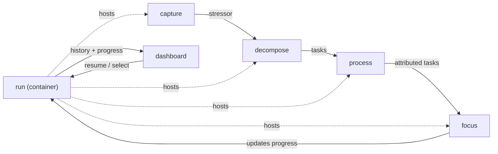

# Module Breakdown

## Overview
Aplikacja to jednokierunkowy lejek wyciągający usera z paraliżu planowania. Rozbijamy ją na **6 modułów projektowych**: 4 Core (kolejne kroki lejka + wykonanie) i 2 Supporting (pojemnik Runa + dashboard motywacyjny). Moduły Core ułożone są w kolejności lejka — każdy zależy od wyjścia poprzedniego. Moduły nazwane po angielsku (code namespaces / foldery).

## Modules

### capture
**Type**: Core
**Description**: Wejście do apki — brain dump („Co cię teraz stresuje?", wpisywanie Enterem) i ułożenie stresorów od najbardziej do najmniej stresującego. Zerowa tarcie, ustawia ton całego narzędzia.
**Entities**: `Stressor`
**Key Actions**: Add Stressor (Enter), Rank Stressor, Edit Stressor, Delete Stressor
**Connects to**: `decompose` (przekazuje uporządkowane stressory do rozbicia); `run` (implicite tworzy nowy Run przy starcie)
**Design priority**: Medium — niska złożoność, ale to pierwszy kontakt i must-feel-good dla obietnicy „bez decydowania".

### decompose
**Type**: Core
**Description**: Dla każdego stresora pojedynczo: wypisanie next-actions i rozbicie ich na konkretne, wykonalne taski (konkretny next-action = 1 task; gruby = kilka).
**Entities**: `NextAction`, `Task` (tworzenie)
**Key Actions**: Add NextAction, Decompose into Tasks, Edit, Delete
**Connects to**: `capture` (pobiera stressory); `process` (przekazuje taski do opisania atrybutami)
**Design priority**: Medium — kluczowy pomost od „stresora" do „wykonalnej jednostki".

### process
**Type**: Core
**Description**: Procesowanie GTD-style (wzorzec inboxa jak w *dopadone*): każdemu taskowi przypisuje się `Context`, `Energy` i `EstimatedTime`. To, co później umożliwia filtrowanie sesji.
**Entities**: `Task` (atrybuty)
**Key Actions**: Assign Context / Energy / EstimatedTime, Edit Task
**Connects to**: `decompose` (pobiera taski bez atrybutów); `focus` (przekazuje opisane taski do filtrowania)
**Design priority**: High — efektywne przypinanie 3 atrybutów decyduje o tym, czy filtr sesji zadziała.

### focus
**Type**: Core
**Description**: Serce apki: wybór sesji (konteksty + poziomy energii → filtr), sesja focus (jedno zadanie na ekranie pod timerem, done/skip/back), a na końcu podsumowanie z „Usuń skończone". Tu spoczywa obietnica: jedno zadanie goni drugie, zdejmujemy ciężar decydowania.
**Entities**: `FocusSession`, `Timer`, `SessionSummary`, `Task` (stany)
**Key Actions**: Filter session, Start, Done / Skip / Back, Timer pause/resume, View Summary, ClearCompleted
**Connects to**: `process` (pobiera opisane taski); `run` (wynik sesji aktualizuje progres Runa)
**Design priority**: High — największa złożoność i ryzyko (maszyneria stanów, wznawianie timera) oraz największy wpływ na usera.

### run
**Type**: Supporting
**Description**: Cykl życia Runa — pojemnik najwyższego poziomu: tworzenie, wznawianie tam gdzie skończono, liczenie progresu (`completedTasks / totalTasks`), review-on-resume (decyzja co nadal obowiązuje), zmiana nazwy, usuwanie.
**Entities**: `Run`
**Key Actions**: Create Run, Resume Run, View progress, Review on resume, Rename Run, Delete Run
**Connects to**: wszystkie moduły Core (każda akcja lejka dzieje się wewnątrz aktywnego Runa); `dashboard` (udostępnia historię i progres)
**Design priority**: Medium — potrzebny, by cokolwiek trzymać, ale na MVP wystarczy minimalny (jeden aktywny Run); pełna persystencja/resume dokładana później.

### dashboard
**Type**: Supporting
**Description**: Ekran motywacyjny: historia runów, progres każdego z nich i porównanie przejazdów. Wartość wyłoniona w deepen — łapanie motywacji przez kontrast z poprzednimi przejazdami.
**Entities**: — (czyta `Run` i jego progres)
**Key Actions**: View Dashboard, Compare runs
**Connects to**: `run` (wybór runa do wznowienia; odczyt historii/progresu)
**Design priority**: Low — warstwa motywacji, budowana na końcu; na MVP można pominąć i startować prosto z lejka.

---

## Integration Map

Linie ciągłe = przepływ danych lejka; kropkowane = relacja hosts (każdy krok Core żyje wewnątrz aktywnego Runa).

## Prototyping Order

1. **`capture`** — wejście; tworzy Runa implicite; niskie ryzyko; reszta zależy od stressorów. Ustawia ton.
2. **`decompose`** — potrzebuje stressorów z `capture`; pomost do tasków.
3. **`process`** — potrzebuje tasków z `decompose`; warunek konieczny, by `focus` miał co filtrować.
4. **`focus`** — payoff całego lejka; najwięcej uwagi projektowej; można też prototypować wcześnie z mock-taskami, by szybko zweryfikować obietnicę.
5. **`run`** — jak zadziała pojedynczy przejazd, dokładasz persystencję, resume i review-on-resume.
6. **`dashboard`** — warstwa motywacji/historii; na końcu, opcjonalna na MVP.

## Priority Areas

- **`focus`**: najwyższy priorytet projektowy. Tu realizuje się obietnica apki; największa złożoność (timer liczący w dół/w górę, maszyneria stanów done/skip/back, wznawianie timera per task) i największe ryzyko produktowe — kluczowe pytanie, czy „goniące się zadania" faktycznie zdejmują paraliż, czy odczuwane są jako sztywna klatka.
- **`process`**: wysoki priorytet. Efektywne, bezfriction przypinanie trzech atrybutów (kontekst / energia-bateryjki / czas-presety) decyduje o użyteczności filtra sesji. Wzorzec inspirujący: *dopadone*.
- **Przepływ lejka (cross-cutting)**: jak kroki płynnie, jednokierunkowo się łączą — tak, by prowadzić za rękę, nie dusząc. Dotyka wszystkich modułów Core; weryfikować od pierwszego lofi.
