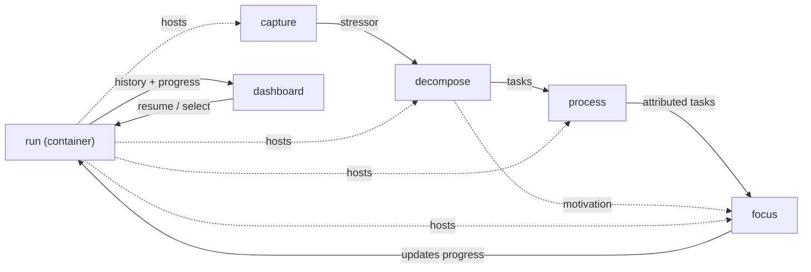

# Module Breakdown

## Overview
The app is a one-way funnel that pulls the user out of planning paralysis. We break it into **6 project modules**: 4 Core (successive funnel steps + execution) and 2 Supporting (the Run container + a motivational dashboard). The Core modules are ordered along the funnel — each depends on the previous one's output. Modules are named in English (code namespaces / folders).

## Modules

### capture
**Type**: Core
**Description**: The app's entrance — brain dump ("What's stressing you right now?", typing with Enter) and ordering stressors from most to least stressful. Zero friction, sets the tone for the whole tool.
**Entities**: `Stressor`
**Key Actions**: Add Stressor (Enter), Rank Stressor, Edit Stressor, Delete Stressor
**Connects to**: `decompose` (passes the ordered stressors on for breakdown); `run` (implicitly creates a new Run on start)
**Design priority**: Medium — low complexity, but it's the first contact and the must-feel-good moment for the "no deciding" promise.

### decompose
**Type**: Core
**Description**: For each stressor one at a time (starting with the most stressful): WHY — the motivational material (reasons + done vision, which "charges the battery" for `focus`) — and HOW — next-actions written in active/concrete language, broken down into doable tasks (a concrete next-action = 1 task; a coarse one = several). Driver: a large task paralyzes, so it has to be broken down (ADHD/overwhelmed persona — ADR 0007).
**Entities**: `Reason`, `DoneVision`, `NextAction`, `Task` (creation)
**Key Actions**: Add Reason / DoneVision, Skip motivation, Add NextAction, Decompose into Tasks, Edit, Delete
**Connects to**: `capture` (pulls the stressors); `process` (passes the tasks on to be given attributes); `focus` (passes the motivational material, **always visible** on the task screen)
**Design priority**: Medium — the bridge from "stressor" to "a doable unit" + the store of motivational fuel.

### process
**Type**: Core
**Description**: GTD-style processing (the inbox pattern like in *dopadone*): each task gets a `Context`, `Energy`, and `EstimatedTime`. This is what later enables session filtering.
**Entities**: `Task` (attributes)
**Key Actions**: Assign Context / Energy / EstimatedTime, Edit Task
**Connects to**: `decompose` (pulls tasks without attributes); `focus` (passes the attributed tasks on for filtering)
**Design priority**: High — efficiently pinning the 3 attributes decides whether the session filter works.

### focus
**Type**: Core
**Description**: The heart of the app: session selection (contexts + energy levels → filter), the focus session (one task on screen under a timer, done/skip/back), and finally the summary with "Clear completed". This is where the promise lives: one task chases the next, and we lift the burden of deciding.
**Entities**: `FocusSession`, `Timer`, `SessionSummary`, `Task` (states)
**Key Actions**: Filter session, Start, Done / Skip / Dismiss (stale) / Back, Timer pause/resume, View Summary, ClearCompleted
**Connects to**: `process` (pulls the attributed tasks); `run` (the session result updates the Run's progress)
**Design priority**: High — the greatest complexity and risk (the state machinery, timer resumption) and the biggest impact on the user.

### run
**Type**: Supporting
**Description**: The Run lifecycle as a **visible, statistical object** — the top-level container: creation, Continue (smart-routing to the furthest step that has work), the statistics screen (time spent, completed `completed + dismissed`, remaining, progress), review (manual — what still applies), rename, archiving (reversible) / un-archiving, deletion. Many runs live in parallel, launched from the dashboard. Details: `docs/modules/run.md`. (ADR 0020)
**Entities**: `Run`
**Key Actions**: Create Run, Continue (resume), View Details/Stats, Rename Run, Review, Archive Run, Un-archive Run, Delete Run
**Connects to**: all the Core modules (every funnel action happens inside the active Run); `dashboard` (the launcher list + archive/history; a Run card = Continue + Details)
**Design priority**: Medium — the persistence layer + deliberate run management (ADR 0020 supersedes the early "MVP = one active Run" note).

### dashboard
**Type**: Supporting
**Description**: **The app's launch runway, not a neutral list** — in one click it drops the user back into work. The dominant card of the most-recently-worked-on run (large, progress in the foreground, Continue primary) + a deliberate "start new" next to it; below it, smaller cards of active runs (each Continue + Details, sorted by `lastActiveAt`); at the end of the list, an entrance to the archive/history. Motivation = mostly progress momentum. ~~Comparison/"Compare runs"~~ dropped from the MVP. Details: `docs/modules/dashboard.md`. (ADR 0026, 0027, 0028)
**Entities**: — (reads `Run` and its progress)
**Key Actions**: View Dashboard, Continue (resume), View Details/Stats, Start new Run, Enter archive, Un-archive
**Connects to**: `run` (reads runs + `lastActiveAt`; launches Continue/Create/Details/archive); indirectly all Core modules via Continue (smart-routing)
**Design priority**: Low — a launcher + motivation layer, built last; can be skipped on the MVP in favor of starting straight from the funnel.

---

## Integration Map

```mermaid
graph LR
    run["run (container)"]
    capture -->|stressor| decompose
    decompose -->|tasks| process
    process -->|attributed tasks| focus
    decompose -.->|motivation| focus
    focus -->|updates progress| run
    run -.hosts.-> capture
    run -.hosts.-> decompose
    run -.hosts.-> process
    run -.hosts.-> focus
    dashboard -->|resume / select| run
    run -->|history + progress| dashboard
```

Solid lines = the funnel's data flow; dotted = the hosts relation (every Core step lives inside the active Run) and additional flows (e.g. the motivational material `decompose` → `focus`).

## Prototyping Order

1. **`capture`** — the entrance; creates a Run implicitly; low risk; everything else depends on the stressors. Sets the tone.
2. **`decompose`** — needs the stressors from `capture`; the bridge to tasks.
3. **`process`** — needs the tasks from `decompose`; a prerequisite for `focus` to have anything to filter.
4. **`focus`** — the payoff of the whole funnel; the most design attention; can also be prototyped early with mock tasks to quickly verify the promise.
5. **`run`** — once a single run-through works, you add persistence, resume, and review-on-resume.
6. **`dashboard`** — the motivation/history layer; last, optional on the MVP.

## Priority Areas

- **`focus`**: the highest design priority. This is where the app's promise is realized; the greatest complexity (a timer counting down/up, the done/skip/back state machinery, per-task timer resumption) and the biggest product risk — the key question of whether "tasks chasing each other" actually lifts the paralysis or feels like a rigid cage.
- **`process`**: high priority. Efficient, friction-free pinning of the three attributes (context / energy-batteries / time-presets) decides how useful the session filter is. Inspiring pattern: *dopadone*.
- **The funnel flow (cross-cutting)**: how the steps connect smoothly and one-way — leading by the hand without suffocating. It touches all the Core modules; verify from the first lofi onward.
